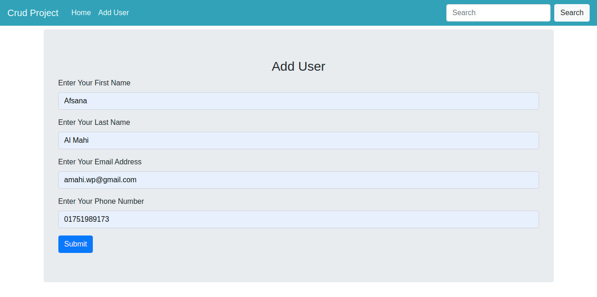

# Frist Crud Application Usin Laravel
This is a Normal Crud Application useing Laravel. There only Add User and Read User and Edit or Delete User information

## Customer functions

Customer has many access. Such as,
* Create Profile
* Read Profile
* Update profile
* Change profile information
* Delete Profile

* And many more....

### Demo

Link: Disable Now.

# Some screenshoot of the project

### Home page

### Edit User Page

### Add User Page

### Update Profile Page

